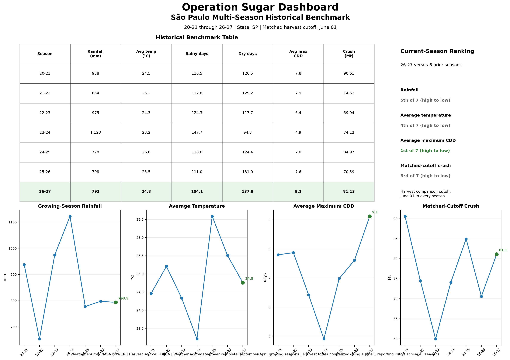
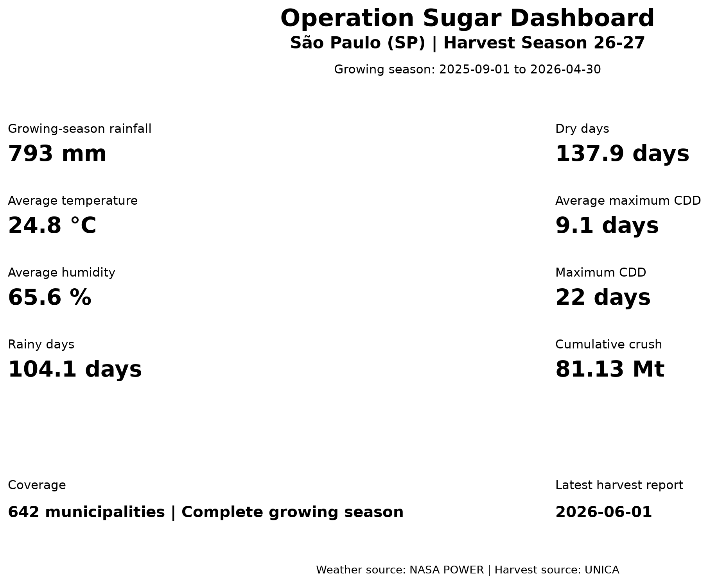

# Operation Sugar

An open-source research engineering platform for Brazilian sugarcane analytics.

Operation Sugar integrates official Brazilian sugarcane production statistics (IBGE), daily weather observations (NASA POWER), and harvest reports (UNICA) into reproducible datasets, modular ETL pipelines, and transparent research workflows for quantitative agricultural research.

---

## Highlights

- 🌎 Weather and harvest analytics across 642 Brazilian sugar-producing municipalities
- 🌦️ Integrated NASA POWER, IBGE, and UNICA public datasets
- 📈 Seven-season historical benchmarking framework
- 🧪 167 automated unit tests (147 dedicated to the UNICA ETL pipeline)
- 📊 Automated weather–harvest analytics dashboards
- 🏗️ Modular ETL, validation, and feature engineering architecture

---

## Dashboard Preview

### Season Comparison Dashboard



*Compare historical weather conditions and matched-cutoff harvest progress across multiple Brazilian sugarcane seasons.*

### Single-season Dashboard



*Detailed weather and harvest analytics for an individual growing season.*

---

## Architecture

```text
          IBGE
           │
           ▼
     Production Data
           │
           ▼

NASA POWER ──► Weather ETL ──┐
                             │
UNICA ───────► Harvest ETL ──┼──► Weather–Harvest Dataset
                             │
Growing-Season Features ─────┘
                 │
                 ▼
      Historical Benchmark
           Dashboards
```

---

## Core Capabilities

- Automated NASA POWER weather ingestion
- UNICA harvest report ETL pipeline
- Historical harvest database updater
- Municipality-level weather aggregation
- Growing-season feature engineering
- Weather–harvest dataset construction
- Historical benchmark dashboards
- Comprehensive data validation
- 167 automated unit tests

---

## Project Goals

Operation Sugar aims to build a reproducible end-to-end research platform that:

- Cleans and validates Brazilian sugarcane production data
- Engineers biologically meaningful weather features
- Integrates heterogeneous public datasets into unified research workflows
- Produces analysis-ready datasets for exploratory analysis, statistical modeling, and future forecasting research

---

## Current Version Limitations

Version 1.2 focuses on weather-driven biomass accumulation.

It does not currently model:

- Sugar price
- Sucrose concentration
- ATR
- Recoverable sugar
- Mill-level production

The scope is intentionally limited to establish a reliable and reproducible research platform before incorporating more advanced environmental variables and predictive models.

---

## Project Structure

```text
Operation Sugar
│
├── data
│   ├── raw/
│   │   ├── nasa_power/
│   │   └── unica/
│   │
│   ├── processed/
│   └── metadata/
│
├── docs/
│
├── src/
│   ├── etl/
│   ├── feature_engineering/
│   ├── pipelines/
│   ├── visualization/
│   └── schemas/
│
├── src/tests/
│
├── CHANGELOG.md
├── ROADMAP.md
├── research_engineering_challenges.md
├── LICENSE
├── README.md
└── requirements.txt
```

---

## Documentation

Additional project documentation is available below.

| Document | Description |
|----------|-------------|
| **[Research Engineering Challenges](research_engineering_challenges.md)** | Engineering decisions behind the platform, including heterogeneous data integration, temporal alignment, validation, and reproducible research workflows. |
| **[ROADMAP](ROADMAP.md)** | Planned development milestones and future project direction. |
| **[CHANGELOG](CHANGELOG.md)** | Complete release history and notable project updates. |

---

## Data Sources

| Source | Description |
|---------|-------------|
| **NASA POWER** | Daily gridded weather observations including precipitation, air temperature, and relative humidity. |
| **IBGE** | Official Brazilian municipality metadata and annual sugarcane production statistics. |
| **UNICA** | Harvest progress, sugarcane crushing, sugar production, and ethanol production statistics for Brazil's Center-South region. |

Operation Sugar integrates these heterogeneous public datasets into a unified analysis-ready database through reproducible ETL pipelines.

---

## Why Operation Sugar?

Public agricultural datasets are often fragmented across multiple organizations, formats, and temporal resolutions.

Operation Sugar transforms heterogeneous public datasets into reproducible research workflows through modular ETL pipelines, automated validation, and transparent feature engineering.

Rather than focusing solely on forecasting models, the project emphasizes the research infrastructure required to produce reliable analytical datasets.

---

## Project Statistics

| Metric | Value |
|--------|-------|
| Municipalities | 642 |
| Weather Archive | 2019–20 to 2026–27 Growing Seasons |
| Weather Variables | Rainfall, Temperature, Relative Humidity |
| Historical Harvest Seasons | 2020–21 to 2026–27 |
| Automated Tests | 167 |
| Python | 3.12 |

The project follows a modular research engineering architecture with dedicated ETL, validation, feature engineering, visualization, and testing components to ensure reproducibility and maintainability.

---

## Engineered Features

### Weather Features

- Growing-season rainfall
- Rainy days
- Dry days
- Average temperature
- Average humidity
- Maximum consecutive dry days
- Average maximum consecutive dry days

### Harvest Features

- Harvest season
- Latest report date
- Harvest period count
- Cumulative crushing

---

## Output

The pipeline produces:

- Daily municipality weather observations
- Monthly weather summaries
- Growing-season weather features
- Historical UNICA harvest database
- Weather–harvest datasets
- Historical benchmark dashboards

---

## Pipeline Workflow

```text
Metadata
    │
    ▼
NASA POWER ETL
    │
    ▼
UNICA ETL
    │
    ▼
Validation
    │
    ▼
Growing-Season Features
    │
    ▼
Weather-Harvest Dataset
    │
    ▼
Historical Benchmark Dashboards
```

---

## Testing

Run all tests

```bash
python -m pytest src/tests -v
```

Current status

```text
167 automated unit tests
100% passing
```

The UNICA ETL pipeline is supported by 147 automated unit tests covering PDF parsing, table extraction, normalization, validation, cumulative harvest calculations, and historical database updates.

---

## Quick Start

```bash
git clone https://github.com/DuranWang/operation-sugar.git

cd operation-sugar

pip install -r requirements.txt

python -m src.pipelines.run_pipeline

python -m pytest src/tests -v
```

The research pipeline automatically:

- aggregates monthly weather
- engineers growing-season features
- builds the weather–harvest dataset
- generates all dashboard figures

Generated datasets are saved under:

- `data/processed/`

Dashboard figures are exported to:

- `docs/`

---

## Learn More

Interested in the engineering decisions behind Operation Sugar?

Read **[Research Engineering Challenges](research_engineering_challenges.md)** to learn how the platform evolved from a forecasting project into a reproducible research engineering platform.

See **[ROADMAP](ROADMAP.md)** for planned future development.

See **[CHANGELOG](CHANGELOG.md)** for release history.

---

## License

Released under the MIT License.

---

## Contributing

Suggestions, bug reports, feature requests, and research collaborations are always welcome.