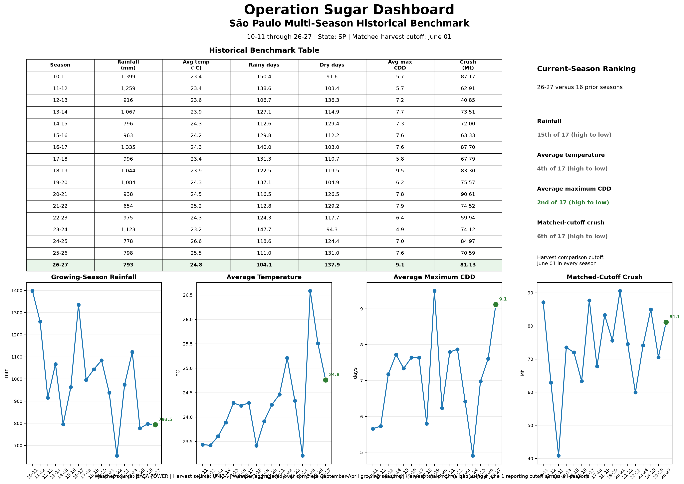
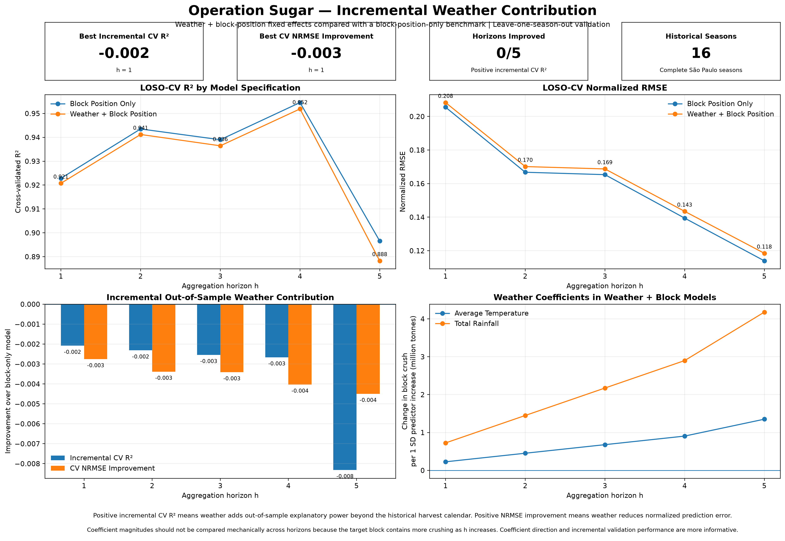
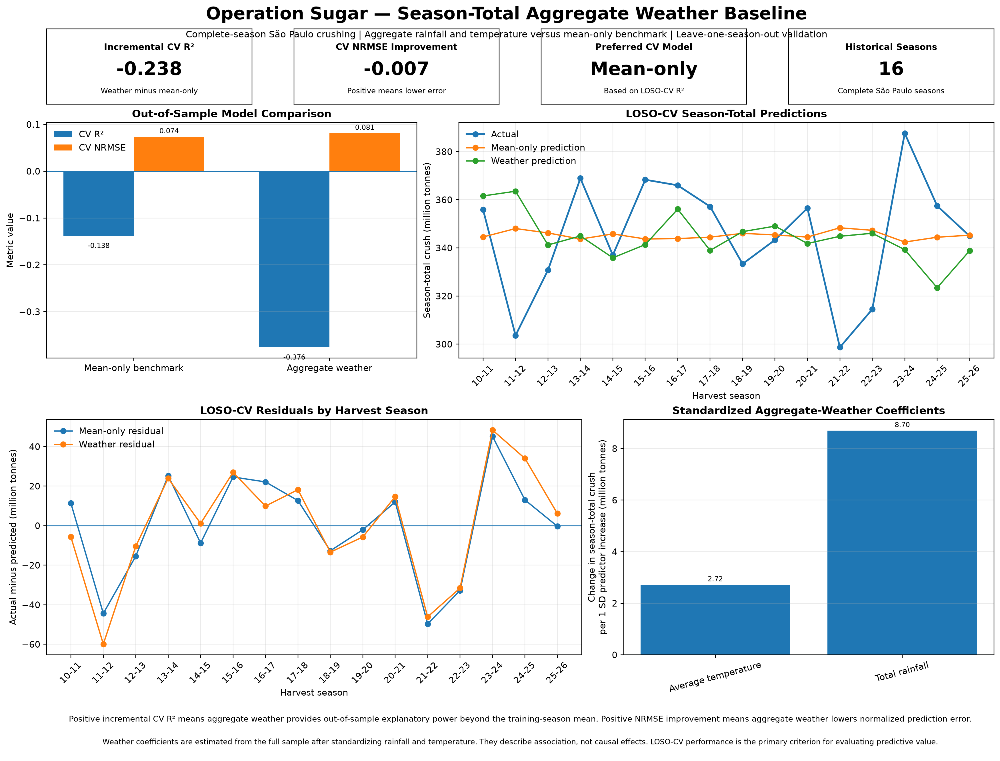
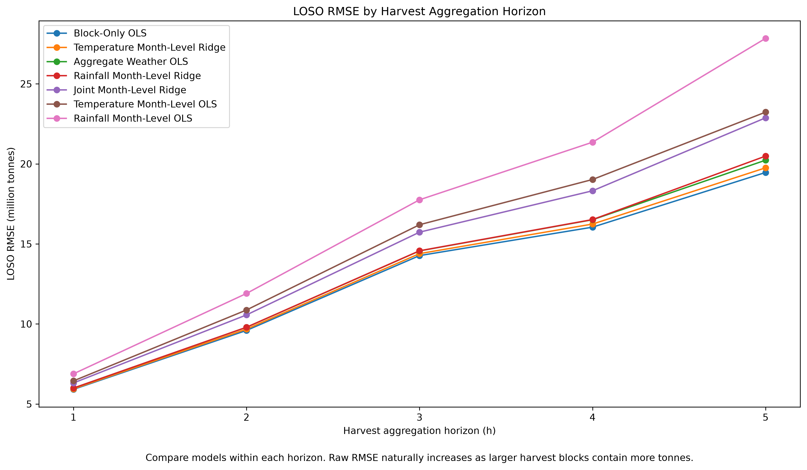
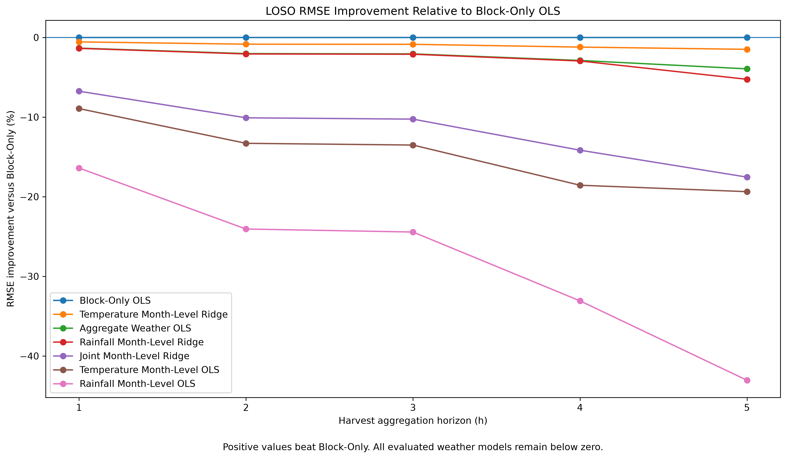
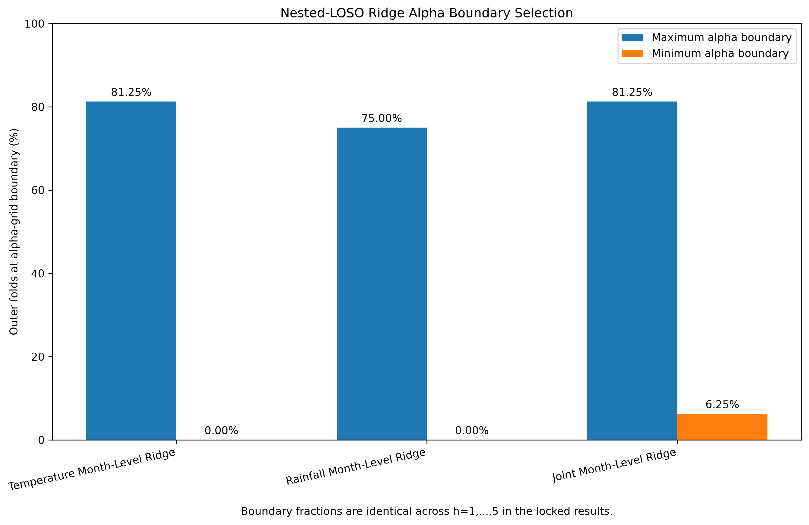
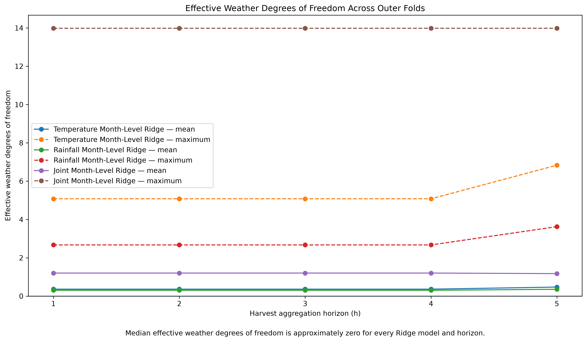

# Operation Sugar


An open-source research engineering platform for Brazilian sugarcane weather and harvest analytics.

Operation Sugar integrates official Brazilian sugarcane production statistics (IBGE), daily weather observations (NASA POWER), and harvest reports (UNICA) into reproducible datasets, modular ETL pipelines, historical harvest intelligence, and statistically validated modeling workflows for quantitative agricultural research.

Rather than focusing solely on predictive performance, the project emphasizes reproducible research infrastructure, biologically meaningful feature engineering, transparent statistical evaluation, and rigorous out-of-sample validation.

---

## Highlights

- 🌎 Weather analytics across **642 São Paulo sugar-producing municipalities**
- 🌦️ Integrated **NASA POWER**, **IBGE**, and **UNICA** public datasets
- 📈 Historical harvest intelligence across **16 completed sugarcane seasons**
- 📊 **Seven statistical models** evaluated across **five harvest aggregation horizons**
- 🧠 Month-level rainfall and temperature modeling with **nested leave-one-season-out validation**
- 📉 Fold-specific feature standardization and **partially penalized Ridge regression**
- 🔍 Ridge stability and effective weather degrees-of-freedom diagnostics
- 🧪 **174 automated unit tests**, including **147 dedicated to the UNICA ETL pipeline**
- 🏗️ Modular ETL, validation, analytics, modeling, visualization, and research architecture

---

## Research Dashboard

### Weather & Harvest Benchmark

<p align="center">
  
</p>

Compare historical weather conditions and matched-cutoff harvest progress across multiple São Paulo sugarcane seasons.

---

### Historical Harvest Calendar

<p align="center">
  
</p>

Visualize how annual sugarcane crushing is distributed across sixteen completed São Paulo harvest seasons.

---

### Historical Percentile Benchmark

<p align="center">
  
</p>

Benchmark the current harvest against the historical distribution of completed seasons.

---

### Harvest-Block Aggregate Weather Baseline

<p align="center">
  
</p>

Evaluate whether aggregate growing-season weather improves out-of-sample prediction of harvest-block crushing beyond historical harvest timing.

---

### Complete-Season Aggregate Weather Baseline

<p align="center">
  
</p>

Compare aggregate weather predictors against a historical mean benchmark for complete-season crushing using leave-one-season-out cross-validation.

---

### Seven-Model Month-Level Comparison

<p align="center">
  
</p>

Compare seven statistical models across five harvest aggregation horizons under identical leave-one-season-out evaluation.

---

### Incremental Value Beyond the Historical Harvest Profile

<p align="center">
  
</p>

Measure whether aggregate and month-level weather features provide additional predictive value beyond the historical harvest profile.

---

### Ridge Stability Diagnostics

<p align="center">
  
</p>

Visualize how frequently nested cross-validation selects boundary Ridge penalties across seasons and prediction horizons.

---

### Effective Weather Degrees of Freedom

<p align="center">
  
</p>

Compare the typical amount of weather information retained by Ridge with the maximum retained in influential validation folds.

---

For the harvest methodology, see [`docs/harvest_intelligence.md`](docs/harvest_intelligence.md).

For the stable statistical methodology, see [`docs/modeling_framework.md`](docs/modeling_framework.md). For Version 1.5.1 results and diagnostics, see [`docs/research/month_level_model_findings.md`](docs/research/month_level_model_findings.md).

---

## Key Version 1.5.1 Findings

Seven statistical models were evaluated using identical leave-one-season-out cross-validation across five harvest aggregation horizons.

| Rank | Model | Relative RMSE vs. Block-Only |
|-----:|------------------------------|----------------:|
| 1 | Block-Only OLS | 0.00% |
| 2 | Temperature Month-Level Ridge | -1.00% |
| 3 | Aggregate Weather OLS | -2.45% |
| 4 | Rainfall Month-Level Ridge | -2.75% |
| 5 | Joint Month-Level Ridge | -11.76% |
| 6 | Temperature Month-Level OLS | -14.73% |
| 7 | Rainfall Month-Level OLS | -28.20% |

Negative values indicate worse out-of-sample RMSE than the historical Block-Only benchmark.

### Main Findings

- Historical harvest timing remained the strongest predictor across every aggregation horizon.
- Ridge regression substantially reduced overfitting relative to unregularized month-level models.
- Month-level temperature contained more stable predictive structure than month-level rainfall.
- Nested leave-one-season-out validation selected the maximum Ridge penalty in most outer folds, indicating that only a very small amount of weather complexity generalized across seasons.
- Within the available sixteen-season historical sample, growing-season weather variables did **not** provide stable incremental predictive value beyond the historical harvest profile for harvest-block crushing prediction.

This conclusion is intentionally narrow.

It does **not** imply that weather has no influence on sugarcane production. Instead, it indicates that the evaluated linear aggregate and month-level weather specifications do not outperform a simple historical harvest-calendar benchmark under rigorous out-of-sample validation.

---

## Why Operation Sugar?

Brazilian sugarcane data are publicly available but fragmented across multiple organizations, temporal resolutions, and geographic scales.

Weather observations, agricultural production statistics, and harvest reports are published independently and require substantial engineering before they can be analyzed together.

Operation Sugar integrates these heterogeneous public datasets into a reproducible research platform for weather analytics, harvest intelligence, feature engineering, statistical modeling, and quantitative agricultural research.

Rather than treating data engineering and statistical modeling as separate tasks, the platform is designed to provide an end-to-end research workflow in which every analytical result can be reproduced directly from the underlying public data sources.

---

## Core Capabilities

Operation Sugar provides an end-to-end research engineering workflow for Brazilian sugarcane weather and harvest analytics.

### Data Engineering

- Automated NASA POWER weather ingestion
- Municipality metadata integration
- UNICA harvest report ETL pipeline
- Historical harvest database updater
- Comprehensive schema validation

### Weather Analytics

- Municipality-level monthly weather aggregation
- Growing-season weather summaries
- September–April month-level rainfall features
- September–April month-level temperature features
- Weather–harvest dataset construction

### Harvest Intelligence

- Historical harvest calendar construction
- Monthly crushing distribution analysis
- Historical percentile-band benchmarking
- Comparable historical harvest snapshots
- Harvest timing metrics
- Automated harvest research summaries

### Statistical Modeling

- Block-Only historical benchmark
- Aggregate Weather OLS
- Complete-Season Aggregate Weather OLS
- Rainfall Month-Level OLS
- Temperature Month-Level OLS
- Rainfall Month-Level Ridge
- Temperature Month-Level Ridge
- Joint Rainfall–Temperature Ridge
- Seven-model comparison framework
- Leave-One-Season-Out cross-validation
- Nested Leave-One-Season-Out Ridge selection

### Research Infrastructure

- Modular project architecture
- Automated visualization pipeline
- Publication-style reporting figures
- Comprehensive validation framework
- Automated testing
- Reproducible research documentation

---

## Repository Statistics

| Metric | Value |
|---------|------:|
| Municipalities | 642 |
| Historical Weather Archive | September 2009 – April 2026 |
| Historical Harvest Seasons | 17 (16 completed) |
| Weather Variables | Rainfall, Temperature, Relative Humidity |
| Month-Level Weather Features | September–April Rainfall & Temperature |
| Statistical Models | 7 |
| Harvest Aggregation Horizons | 5 |
| Validation Strategy | Leave-One-Season-Out |
| Ridge Hyperparameter Selection | Nested Leave-One-Season-Out |
| Automated Tests | 174 |
| UNICA ETL Tests | 147 |
| Python | 3.12 |

---

## Documentation

Detailed project documentation is available under the **docs/** directory.

| Document | Description |
|----------|-------------|
| [`docs/architecture.md`](docs/architecture.md) | Overall platform architecture and repository organization |
| [`docs/analytical_framework.md`](docs/analytical_framework.md) | Construction and validation of analytical variables |
| [`docs/modeling_framework.md`](docs/modeling_framework.md) | Stable statistical modeling and validation methodology |
| [`docs/seasonal_framework.md`](docs/seasonal_framework.md) | Biological and operational seasonal structure |
| [`docs/harvest_intelligence.md`](docs/harvest_intelligence.md) | Historical harvest benchmark methodology |
| [`docs/feature_dictionary.md`](docs/feature_dictionary.md) | Definitions of engineered variables |
| [`docs/research/research_decisions.md`](docs/research/research_decisions.md) | Major engineering and analytical decisions |
| [`docs/research/statistical_experiments.md`](docs/research/statistical_experiments.md) | Statistical experiment specifications and records |
| [`docs/research/month_level_model_findings.md`](docs/research/month_level_model_findings.md) | Version 1.5.1 modeling results and interpretation |
| [`docs/research/negative_results.md`](docs/research/negative_results.md) | Modeling approaches that did not generalize |
| [`ROADMAP.md`](ROADMAP.md) | Planned future development |
| [`CHANGELOG.md`](CHANGELOG.md) | Release history |

For readers interested in the complete modeling methodology, validation procedure, and experimental results, the documentation provides substantially more detail than this project overview.

---

## Quick Start

Clone the repository.

```bash
git clone https://github.com/DuranWang/operation-sugar.git

cd operation-sugar
```

Install dependencies.

```bash
pip install -r requirements.txt
```

Run the complete research pipeline.

```bash
python -m src.pipelines.run_pipeline
```

Execute the automated test suite.

```bash
python -m pytest src/tests -v
```

---

## Reproducing the Version 1.5.1 Study

The complete month-level weather modeling workflow can be reproduced by executing the modeling modules in sequence.

```bash
python -m src.modeling.aggregate_baseline

python -m src.modeling.block_only_baseline

python -m src.modeling.month_level_baseline

python -m src.modeling.rainfall_month_level_ridge

python -m src.modeling.temperature_month_level_ols

python -m src.modeling.temperature_month_level_ridge

python -m src.modeling.joint_month_level_ridge

python -m src.modeling.month_level_model_comparison

python -m src.visualization.month_level_model_reporting
```

Primary modeling outputs are written to:

```text
data/processed/modeling/
```

Research figures are generated under:

```text
docs/figures/
```

The complete methodology and interpretation are documented in:

```text
docs/research/month_level_model_findings.md
```

---

## Testing

Run the complete automated test suite.

```bash
python -m pytest src/tests -v
```

Current status:

- ✅ 174 automated tests
- ✅ 100% passing

The test suite covers:

- ETL pipelines
- Schema validation
- Data validation
- Historical harvest processing
- Duplicate detection
- Temporal consistency
- Statistical modeling utilities

---

## Contributing

Suggestions, bug reports, feature requests, and research collaborations are welcome.

Contributions should prioritize:

- Reproducibility
- Transparent assumptions
- Reliable validation
- Interpretable statistical analysis
- Clear documentation
- Incremental analytical value

Please open an issue before submitting major architectural or modeling changes.

---

## License

Released under the MIT License.

For research collaboration, commercial partnerships, or custom development related to Operation Sugar, please contact the author via LinkedIn:

**LinkedIn**

> https://www.linkedin.com/in/duranwang/

or explore the repository discussions and issues on GitHub.

---
