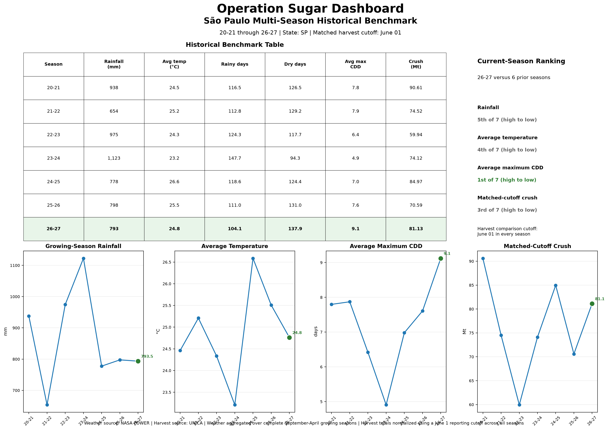
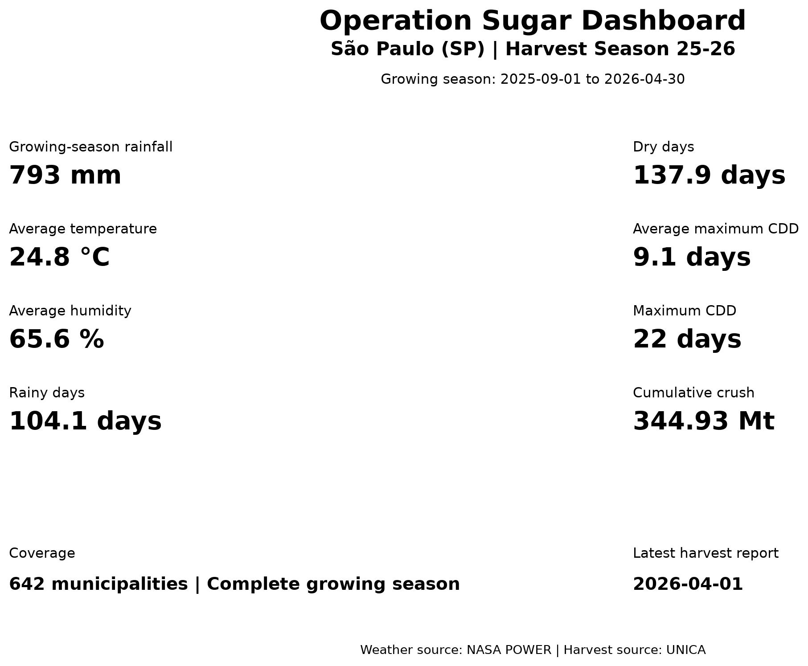

# Operation Sugar

An open-source research engineering platform for Brazilian sugarcane analytics.

Operation Sugar integrates official Brazilian sugarcane production statistics from IBGE, daily weather observations from NASA POWER, and harvest reports from UNICA into reproducible datasets, modular ETL pipelines, and transparent research workflows for quantitative agricultural research.

Rather than focusing solely on predictive models, the project emphasizes reproducible research infrastructure, biologically meaningful seasonal analytics, and transparent engineering workflows for agricultural data science.

---

## Highlights

- 🌎 Weather analytics across 642 Brazilian sugar-producing municipalities
- 🌦️ Integrated NASA POWER, IBGE, and UNICA public datasets
- 📈 Historical harvest analytics across 16 completed sugarcane seasons
- 🗓️ Data-driven harvest timing metrics
- 🧪 167 automated unit tests, including 147 dedicated to the UNICA ETL pipeline
- 📊 Automated weather and historical benchmark dashboards
- 🏗️ Modular ETL, validation, analytics, and visualization architecture

---

## Dashboard Preview

### Season Comparison Dashboard



*Compare historical weather conditions and matched-cutoff harvest progress across multiple Brazilian sugarcane seasons.*

### Single-Season Dashboard



*Detailed weather and harvest analytics for an individual growing and harvest cycle.*

---

## Why Operation Sugar?

Brazilian sugarcane data are publicly available but fragmented across multiple organizations, temporal resolutions, and geographic scales.

Operation Sugar integrates these heterogeneous datasets into a reproducible research platform for weather and harvest analytics.

## Seasonal Research Framework

Operation Sugar studies the annual sugarcane production cycle through three analytical stages.

```text
Growing Stage
        │
        ▼
Maturation Stage
        │
        ▼
Harvest Stage
```

---

## Core Capabilities

Operation Sugar provides a reproducible research engineering workflow for Brazilian sugarcane analytics, including:

- Automated NASA POWER weather ingestion
- UNICA harvest report ETL pipeline
- Historical harvest database updater
- Municipality-level weather aggregation
- Growing-season feature engineering
- Historical harvest calendar construction
- Monthly crushing distribution analysis
- Harvest timing metrics
- Weather–harvest dataset construction
- Historical benchmark dashboards
- Comprehensive data validation
- 167 automated unit tests

---

## Project Goals

Operation Sugar aims to build a reproducible end-to-end research platform that:

- integrates heterogeneous public agricultural datasets;
- engineers interpretable weather and harvest variables;
- produces analysis-ready datasets for statistical analysis;
- supports transparent and reproducible research workflows;
- establishes reliable data infrastructure before predictive modeling;
- evaluates new variables based on their incremental analytical value rather than simply increasing feature count.

---

## Current Version

Version **1.3** establishes the project's baseline research infrastructure.

The current release provides a reproducible platform for weather analytics, harvest analytics, and historical benchmark construction.

See **CHANGELOG.md** for detailed release history.

---

## Current Limitations

Operation Sugar does **not** currently model:

- causal weather–harvest relationships;
- maturation-stage weather effects;
- soil moisture;
- vapor pressure deficit;
- solar radiation;
- evapotranspiration;
- sucrose concentration;
- ATR;
- recoverable sugar;
- mill-level production;
- satellite-derived crop conditions;
- sugar price forecasting.

These topics remain future research directions and are intentionally excluded from Version 1.3.

---

## Documentation

Detailed project documentation is available in the `docs/` directory.

| Document | Description |
|----------|-------------|
| **Architecture** | Overall platform architecture and system organization |
| **Seasonal Framework** | Definitions of growing, maturation, and harvest stages |
| **Analytical Framework** | Design of weather and harvest analytics |
| **Research Decisions** | Major analytical and research decisions |
| **Feature Dictionary** | Definitions of engineered variables |
| **Literature Registry** | Supporting agronomic literature |
| **Research Engineering Challenges** | Engineering challenges encountered during development |
| **ROADMAP** | Planned future development |
| **CHANGELOG** | Release history |

---

## Project Statistics

| Metric | Value |
|--------|-------|
| Municipalities | 642 |
| Monthly Weather Archive | September 2019 – April 2026 |
| Completed Weather Seasons | 2019–20 to 2025–26 |
| Historical Harvest Seasons | 16 |
| Weather Variables | Rainfall, Temperature, Relative Humidity |
| Automated Tests | 167 |
| UNICA ETL Tests | 147 |
| Python | 3.12 |

---

## Engineered Features

### Weather Analytics

- Baseline weather summaries
- Growing-season weather variables
- Drought indicators

### Harvest Analytics

Current harvest analytics include:

- Historical harvest calendar
- Harvest timing metrics
- Season-relative harvest analytics

### Planned Features

Future research will extend the platform with:

- Maturation-stage weather analytics
- Soil moisture
- Vapor pressure deficit (VPD)
- Solar radiation
- Evapotranspiration
- Sugar quality metrics (ATR, sucrose)
- Satellite-derived crop indicators

---

## Data Sources

| Source | Description |
|---------|-------------|
| **NASA POWER** | Daily weather observations |
| **IBGE** | Municipality metadata and annual sugarcane production |
| **UNICA** | Harvest progress and crushing statistics |

These heterogeneous public datasets are integrated through reproducible ETL, validation, aggregation, and analytics workflows.

---

## Output

The pipeline produces:

- processed weather datasets
- harvest analytics datasets
- benchmark dashboards
- unified research datasets

---

## Quick Start

```bash
git clone https://github.com/DuranWang/operation-sugar.git

cd operation-sugar

pip install -r requirements.txt

python -m src.pipelines.run_pipeline

python -m pytest src/tests -v
```

What happens?

✓ Download weather data

✓ Process harvest reports

✓ Build research datasets

✓ Generate dashboards

---

## Testing

Run all tests:

```bash
python -m pytest src/tests -v
```

Current status:

```text
167 automated tests
100% passing
```

The automated test suite covers:

- ETL pipelines
- Validation
- Schema consistency
- Historical harvest processing
- Duplicate detection
- Temporal consistency

---

## Contributing

Suggestions, bug reports, feature requests, and research collaborations are welcome.

Contributions should prioritize:

- reproducibility;
- transparent assumptions;
- reliable validation;
- interpretable analytics;
- clear documentation.

---

## License

Released under the MIT License.

For research collaboration, commercial partnerships, or custom development related to Operation Sugar, please contact the author via LinkedIn:

https://www.linkedin.com/in/duranwang/