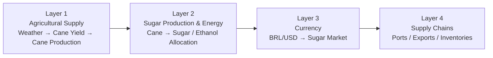
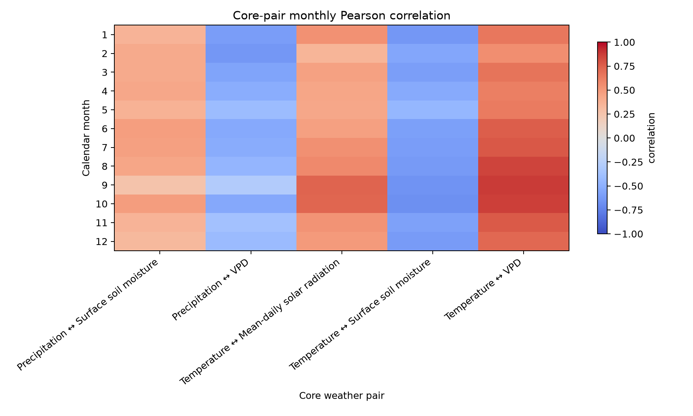
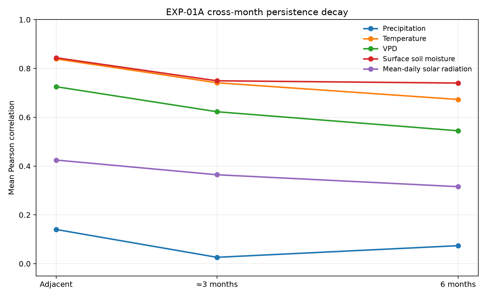
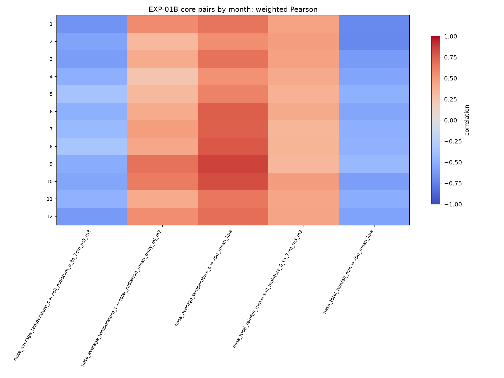
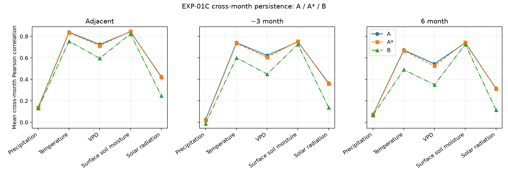
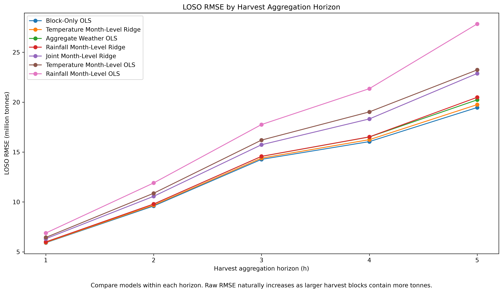

# Operation Sugar


**Independent quantitative research into Brazilian sugarcane and sugar markets, built on public data, explicit benchmarks, and reproducible experiments.**

Operation Sugar (OS) combines weather observations, agricultural statistics, and harvest data to study Brazilian sugar supply. The current research target is **annual agricultural sugarcane yield in São Paulo, measured in tonnes of cane per hectare (TCH)**.

The project is intentionally benchmark-driven. New variables, weighting schemes, and model complexity are only useful if they produce interpretable and reproducible evidence beyond simpler reference specifications.

## Four-Layer Research Framework

Operation Sugar is organized as a four-layer research program:


```mermaid
flowchart LR
    A["Layer 1<br/>Agricultural Supply<br/>Weather → Cane Yield → Cane Production"]
    B["Layer 2<br/>Sugar Production & Energy<br/>Cane → Sugar / Ethanol Allocation"]
    C["Layer 3<br/>Currency<br/>BRL/USD → Sugar Market"]
    D["Layer 4<br/>Supply Chains<br/>Ports / Exports / Inventories"]

    A --> B --> C --> D
```

| Layer | Research focus | Status |
|---|---|---|
| **1. Agricultural supply** | Weather → annual cane yield → cane production | **Active** |
| **2. Sugar production and energy** | Cane → sugar output; recovery / ATR; ethanol–sugar allocation; energy links | Planned |
| **3. Currency** | BRL/USD and sugar prices | Planned |
| **4. Supply chains** | Ports, exports, transport, inventories, and physical availability | Planned |

The layers define a research sequence, not an established causal chain. Cane yield, cane production, sugar output, and sugar prices are separate targets and require separate benchmarks.

---

## Research Snapshot

| Dimension | Current state |
|---|---|
| Primary target | Annual São Paulo sugarcane yield (t/ha) |
| Geographic scope | 642 São Paulo municipalities |
| Current weather research window | 1990–2025 |
| Weather panel | 277,344 municipality-month observations |
| Weather sources | NASA POWER + Open-Meteo / ERA5 |
| Agricultural data | IBGE municipal agricultural statistics; UNICA harvest reports for retained historical studies |
| Verified EXP-01 weather variables | 11 |
| Completed current-stage experiments | EXP-01S, EXP-01A, EXP-01B, EXP-01C |
| Current priority | EXP-02A — long-run trend specification and residual robustness |
| Current release | **v1.6.0 — EXP-01 weather structure, spatial weighting, and robustness framework** |
| Current analysis test status | 52 tests passing as of 2026-09-27 |

## Current Research Program

### EXP-01 — Weather Feature Structure and Spatial Weighting

EXP-01 is complete. It studies **predictor-to-predictor weather structure** before weather variables are interpreted against annual yield.

The four linked analyses are complementary:

| Experiment | Purpose | Status |
|---|---|---|
| **EXP-01S** | Measure stability of municipality harvested-area shares and validate missing-value semantics for weighting | ✅ Complete |
| **EXP-01A** | Measure same-month weather correlation and temporal persistence with equal municipality-year weight | ✅ Complete |
| **EXP-01B** | Repeat the analysis using contemporaneous observed-only sugarcane harvested-area weights | ✅ Complete |
| **EXP-01C** | Separate matched-support effects from harvested-area weighting effects | ✅ Complete |

Curated reports, tables, and figures are stored under:

```text
outputs/research/exp_01/
```

### Selected EXP-01 Findings

#### Same-Month Weather Structure




**1. Weather relationships are strongly calendar-month dependent.**

The five pre-specified basic–advanced weather relationships retained the same sign across all 12 calendar months, but their magnitudes changed materially by month. For example, the monthly Pearson correlation between temperature and VPD ranged from roughly **0.55 to 0.88**.

**2. Pooled correlations can be misleading.**

Precipitation and solar radiation provide a clear example. Their pooled relationship was positive, while within-calendar-month relationships could be strongly negative. This is a seasonal aggregation effect rather than evidence that either calculation is mechanically “wrong.”

**3. Weather variables have very different temporal structures.**

The qualitative persistence ordering was:

```text
surface soil moisture
    > temperature
    > VPD
    > solar radiation
    > precipitation
```

Surface soil moisture and temperature are highly persistent across months. Precipitation behaves much more like a transient or shock-like variable under fixed-calendar comparisons.



**4. Production-footprint weighting changes magnitudes more than support selection does.**

EXP-01C introduced an equal-weight matched-support control, A*, so that:

```text
A   = equal-weight full support
A*  = equal-weight matched harvested-area-observed support
B   = matched support with harvested-area weights
```

Across the 60 core pair × month comparisons, the average weighting effect was an order of magnitude larger than the average support effect. The five pre-specified same-month relationships retained their qualitative direction under A, A*, and B.





**5. São Paulo harvested-area shares are locally stable but not structurally fixed.**

EXP-01S found strong adjacent-year persistence in reported harvested-area shares, while longer-horizon comparisons show material cumulative spatial change. This supports contemporaneous annual weights for historical descriptive analysis, but does **not** make target-year weights automatically forecast-safe.

### Interpretation Boundary

EXP-01 does **not** determine which weather variables should ultimately be kept in a yield model.

A strong predictor correlation does not prove that one variable lacks incremental yield information. Likewise, a material crop-area weighting effect does not prove that weighted weather predicts annual yield better. Those are yield-based questions for later experiments.

---

## Research Sequence

For the current experiment sequence, dependencies, completion criteria, and planned yield-research stages, see [ROADMAP.md](ROADMAP.md).

---

## Related Retained Analysis — Season-Level Basic Weather Correlation

The repository also retains a separate season-level correlation workflow:

```text
src/analysis/analyze_feature_correlation.py
src/analysis/analyze_correlation_stability.py
```

This analysis is **not** a duplicate of EXP-01A/B/C.

It constructs one weather-feature row per complete season, computes Pearson and Spearman correlation matrices, and then performs leave-one-season-out sensitivity analysis to identify influential seasons, coefficient ranges, and sign flips.

This remains useful as a season-level robustness diagnostic for model-ready weather features.

---

## Prior Benchmark Study — v1.5.1

Before the current annual-yield program, OS tested whether September–April rainfall and temperature improved prediction of **harvest-block sugarcane crushing volume** beyond a historical harvest-profile benchmark.

Seven models were compared across five aggregation scales using outer leave-one-season-out evaluation and nested tuning for Ridge models.

The result was negative but useful:

> **The historical harvest-profile benchmark achieved the lowest held-out-season RMSE at every evaluated scale.**

Weather variables did not provide stable incremental predictive value for the evaluated crushing-volume target and linear model family. The result does **not** imply that weather is irrelevant to sugarcane production; it motivated the current shift toward annual agricultural yield.



See:

- [v1.5.1 findings](month_level_model_findings.md)
- [negative-results record](negative_results.md)

---

## Methodology Principles

- **Benchmark discipline:** compare new information against a relevant reference model.
- **Matched samples:** do not mistake data-coverage changes for model improvement.
- **Specification robustness:** retain alternative reasonable definitions when conclusions depend on modeling choices.
- **Time-aware evaluation:** predictive claims require information that would actually have been available at the forecast date.
- **Training-fold preprocessing:** feature selection, standardization, and tuning belong inside the training sample.
- **Negative results:** failed specifications remain part of the research record.
- **Interpretation discipline:** association, predictive information, and causality are separate claims.

---

## Reproducibility

### Set Up

```bash
git clone https://github.com/DuranWang/operation-sugar.git
cd operation-sugar
python -m pip install -r requirements.txt
```

The project targets Python 3.12. Raw weather archives are not fully distributed with the repository, so a complete rebuild requires source-data preparation.

### Current Analysis Modules

```text
src/analysis/exp01s_harvested_area_weight_stability.py
src/analysis/exp01s_observed_weight_stability.py
src/analysis/exp01a_municipality_weather_correlation.py
src/analysis/exp01b_harvested_area_weighted_weather_correlation.py
src/analysis/exp01c_astar_matched_support_comparison.py
```

Curated experiment outputs:

```text
outputs/research/exp_01/
```

### Run Analysis Tests

```bash
python -m pytest src/tests/analysis -q
```

At the current research milestone, this suite passes **52 tests**.

Weather ETL tests are maintained separately under:

```text
src/tests/etl/weather/
```

---

## Documentation

| Document | Purpose |
|---|---|
| [Architecture](docs/architecture.md) | Modules, data flow, and repository organization |
| [Modeling framework](docs/modeling_framework.md) | Model specifications and evaluation methodology |
| [Analytical framework](docs/analytical_framework.md) | Construction and validation of analytical variables |
| [Seasonal framework](docs/seasonal_framework.md) | Biological and operational seasonal definitions |
| [Harvest intelligence](docs/harvest_intelligence.md) | Historical harvest benchmarks |
| [Feature dictionary](docs/feature_dictionary.md) | Engineered-variable definitions |
| [Literature registry](docs/literature_registry.md) | Supporting agronomic literature |
| [Research decisions](research_decisions.md) | Engineering and analytical decisions |
| [Statistical experiments](statistical_experiments.md) | Experiment specifications and records |
| [Roadmap](ROADMAP.md) | Current experiment sequencing and long-term research architecture |
| [Changelog](CHANGELOG.md) | Release history |

---

## Long-Term Benchmarking Goal

OS aims to make commodity forecasts easier to preserve, reproduce, and compare. Planned infrastructure includes standardized forecast records, preserved revisions, historical data vintages where available, and evaluation against multiple public reference forecasts.

Brazilian sugar is the first application. Broader expansion depends on validating the approach in this domain.

## Contributing and Contact

Suggestions, bug reports, and research collaborations are welcome. Contributions should prioritize clear assumptions, reproducibility, appropriate benchmarks, and demonstrable incremental value.

Contact: [Duran Wang on LinkedIn](https://www.linkedin.com/in/duranwang/)

Released under the [MIT License](LICENSE).
