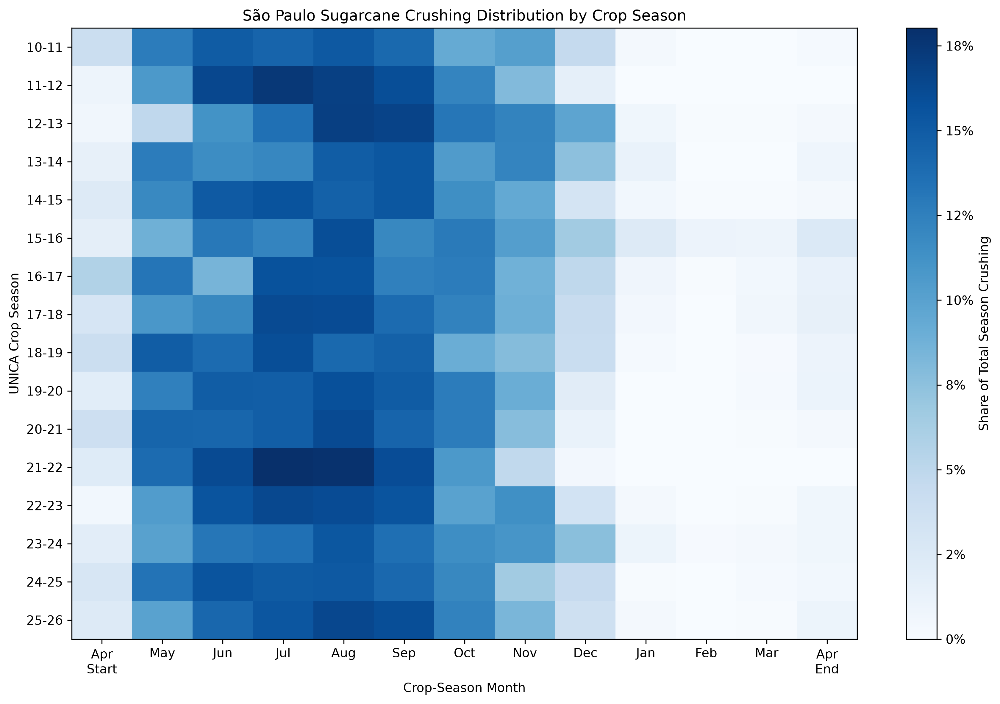
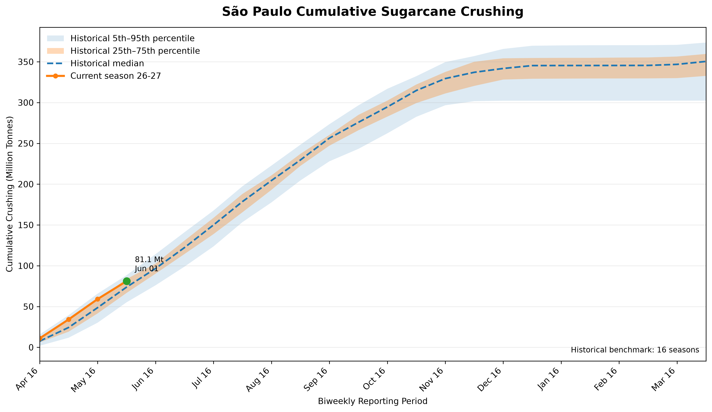

# Harvest Intelligence

## Overview

The Harvest Intelligence module benchmarks the current São Paulo sugarcane harvest against historical crop seasons using standardized biweekly UNICA reporting periods.

Rather than comparing cumulative crushing against the previous season alone, the module evaluates the current harvest relative to the full historical distribution of completed UNICA crop seasons. This provides objective historical context for assessing whether the ongoing harvest is progressing unusually fast, unusually slow, or within its typical historical range.

Current analytical outputs include:

- Cumulative crushing history
- Comparable historical harvest snapshots
- Cumulative crushing pace rankings
- Historical percentile bands
- Automated research summaries

---

## Historical Harvest Calendar

The historical harvest calendar summarizes how annual sugarcane crushing is distributed throughout completed São Paulo crop seasons.

Each row represents a historical crop season, while each column corresponds to a standardized harvest month. Cell values indicate the proportion of annual crushing completed during each month.

This visualization provides historical context for identifying the core harvest window and seasonal crushing patterns.

---

## Historical Percentile Bands

Historical percentile bands visualize the distribution of cumulative crushing across completed historical seasons at each standardized biweekly reporting period.

The chart displays:

- Historical 5th–95th percentile range
- Historical interquartile range (25th–75th percentile)
- Historical median cumulative crushing
- Current crop season progression

This allows the current harvest pace to be evaluated relative to the historical distribution rather than a single reference season.

---

## Harvest Pace Classification

Harvest pace is classified according to the historical percentile of cumulative crushing at the same standardized reporting period.

| Historical Percentile | Classification |
|----------------------:|----------------|
| ≥ 95% | Extremely Fast |
| 75% – 95% | Fast |
| 25% – 75% | Normal |
| 5% – 25% | Slow |
| < 5% | Extremely Slow |

The historical percentile is calculated relative to completed historical seasons only. The current season is excluded from the historical reference distribution to avoid look-ahead bias.

---

## Generated Outputs

The Harvest Intelligence module automatically generates:

- Historical harvest calendar heatmap
- Historical percentile-band visualization
- Cumulative crushing history
- Comparable historical harvest snapshot
- Current season historical ranking
- Historical percentile dataset
- Automated harvest research summary

These outputs are regenerated automatically whenever new UNICA harvest reports become available.